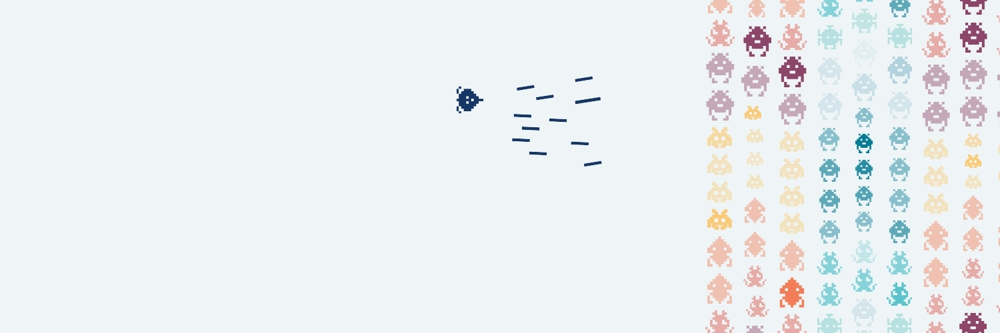

  <picture>
    <source
      media="(prefers-color-scheme: dark)"
      srcset=".github/assets/readme-banner_dark.jpg"
    />
    
  </picture>

__REPO__ a project by REVREBEL

# __REPO_UPPER__

  
  

 
 

## **THE PROJECT**

Run and deploy your AI Studio app
This contains everything you need to run your app locally.

View your app in AI Studio: https://ai.studio/apps/db282079-1249-4553-9e8f-530468a8dfb8

 
 

## **INSTALLATION**

Run Locally
Prerequisites: Node.js

Install dependencies: npm install
Set the GEMINI_API_KEY in .env.local to your Gemini API key
Run the app: npm run dev

## **USAGE**

* <!-- ... [SHOW HOW YOUR PROJECT IS USED] -->

 
 

## **PROJECT TREE**

<!-- ... [SHOW YOUR PROJECT TREE HERE IF USEFUL] -->

 
 

## **NOTES**

* <!-- ... [ADD ADDITIONAL NOTES] -->

 
 

## **SCREENSHOTS**

<!-- ... [SOME DESCRIPTIVE IMAGES] -->

 
 

<table>
  <tbody>
    <tr>
      <td valign="middle" width="1200" height="200" >
          

            
            &emsp;
            
            
            
            
            
          

      </td>
    </tr>
  </tbody>
</table>
